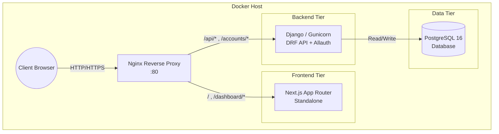
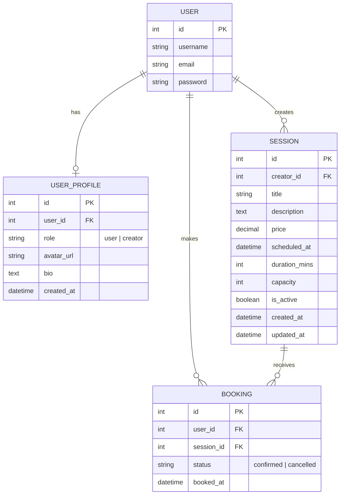
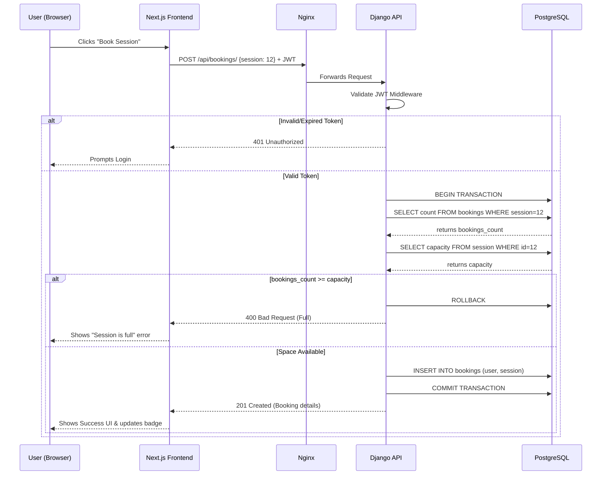

# Ahoum Marketplace: System Design & Architecture

This document provides a comprehensive systemic overview of the Ahoum Marketplace, including Entity-Relationship Diagrams (ERD), High-Level Design (HLD), Low-Level Design (LLD), and detailed API specifications.

---

## 1. High-Level Design (HLD)

The HLD outlines the physical and logical container boundaries. The system uses a decoupled, containerized architecture behind an Nginx reverse proxy.

---

## 2. Entity-Relationship Diagram (ERD)

The core domain model relies on Django's built-in `User` model, extended via a `UserProfile`, and connects to `Session` and `Booking` models.

---

## 3. Low-Level Design (LLD): Booking Data Flow

This sequence diagram illustrates the low-level data flow and transactional behavior when a user attempts to book a session. It highlights authentication checks and capacity validation.

---

## 4. API Specification

The RESTful API is built using Django Rest Framework (DRF). Authentication is handled via SimpleJWT (`Bearer <token>`). 

### 4.1 Authentication & Profile (`apps.accounts`)

| Method | Endpoint | Auth Required | Description | Request Body |
|--------|----------|---------------|-------------|--------------|
| `GET` | `/accounts/google/login/` | No | Initiates Google OAuth2 PKCE flow. | None |
| `GET` | `/api/auth/callback/` | No | OAuth callback redirect. Issues JWT. | `?code=...` (Query) |
| `GET` | `/api/auth/me/` | Yes | Retrieves current user's profile and role. | None |
| `PATCH` | `/api/auth/profile/` | Yes | Updates the user's profile (bio, avatar). | `{ bio: string, avatar_url: string }` |

### 4.2 Marketplace Sessions (`apps.marketplace_sessions`)

*Base URL: `/api/sessions/`* (Handled by DRF `DefaultRouter`)

| Method | Endpoint | Auth Required | Description | Request Body |
|--------|----------|---------------|-------------|--------------|
| `GET` | `/api/sessions/` | No | List all active sessions (paginated). | None |
| `GET` | `/api/sessions/{id}/` | No | Retrieve detailed info for a specific session. | None |
| `POST` | `/api/sessions/` | Yes (Creator) | Create a new session. | `{ title, description, price, scheduled_at, duration_mins, capacity }` |
| `PATCH`| `/api/sessions/{id}/` | Yes (Owner) | Partially update an existing session. | `{ price?: decimal, capacity?: int ... }` |
| `DELETE`| `/api/sessions/{id}/` | Yes (Owner) | Cancel/Delete a session. | None |

### 4.3 Bookings (`apps.bookings`)

*Base URL: `/api/bookings/`*

| Method | Endpoint | Auth Required | Description | Request Body |
|--------|----------|---------------|-------------|--------------|
| `POST` | `/api/bookings/` | Yes | Create a booking for a session. Validates capacity. | `{ session: int (ID) }` |
| `GET` | `/api/bookings/my/` | Yes | List all bookings made by the current user. | None |
| `POST` | `/api/bookings/{id}/cancel/` | Yes (Owner) | Cancel a specific booking. | None |
| `GET` | `/api/bookings/session/{id}/` | Yes (Creator) | List all participants/bookings for a specific session. | None |

---

## 5. Deployment & System Configuration

- **Environment Variables**:
  - `DATABASE_URL`: Injected into Django to map to PostgreSQL. If missing, falls back to local `db.sqlite3`.
  - `NEXT_PUBLIC_API_URL`: Points Next.js to the backend (e.g., `http://localhost/api` via Nginx).
- **CORS Setup**: `CORS_ALLOWED_ORIGINS` must include the Next.js origin. `CORS_ALLOW_CREDENTIALS` is enabled for seamless token exchange if moving to HTTP-only cookies in the future.
- **Port Mapping**: The frontend container exposes port `3000` internally, backend exposes `8000` internally, but Nginx unifies them and exposes port `80` to the host network.
